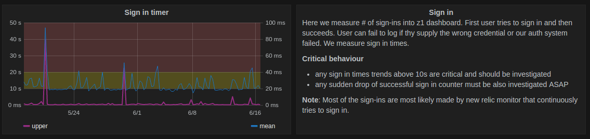

#Monitoring

At zemanta we monitor all web application in real time. We do so, to be able to react to failiures in producion fast. 

In this section we will cover the tools we use for monitoring and alerting and their purpose alongiside use cases.

## InfluxDB + Grafana

One can read about our history of migrating from librato to [influxdb + grafana](http://zemanta.github.io/2016/05/10/from-librato-to-influxdb/) stack to better understand why are we using this metrics stack. 

Every application is emitting lots of real time metrics via the influx client that is embedded into the application.

**Python example**

```python
influx.incr('etl.refresh_k1.refresh_k1_reports', 1, mytag='value')
```

**Go example**

```go
handler.Influx.Counter("bidder.bidHandler.histogram", 1).Tag("bucket", "plus").Submit()
```

For emitting metrics we use:

* [`Zemanta/django-statsd-influx`](https://github.com/Zemanta/django-statsd-influx)
* Internal Go lib, soon to be opensourced

Both libraries above, send metircs to Telegraf via statsd compatibility layer that Telegraf supports. Telegraf then ingests these metrics to InfluxDB. Grafana queries InfluxDB directly for data that's shown in it's dashboards. 


### InfluxDB + Grafana Purpose

* Every important high level feature in our apps should be emitting metric(s) to monitor feature's internal state.
* Every app should also be sending high level performance metrics to InfluxDB.
* Grafana is also the main source of truth for application state and performance the entire team always goes to as the **first point of contact upon state or performance inquiry**. 


### Main Grafana Dashboards

For every application, there's a corresponding Grafana dashboard we call **"main dash"**. As the name reveals, such a dashboard should expose only the main important metrics for that app.

Every panel on such dashboard, should be inlined with documentation explaining:

* what are we looking at
* how to notice critical behaviour
* what are the consequences (preferably consequences for the end user) if a critical state is reached




## Kapacitor

Kapacitor is a standard component of the [influxdata.com's](http://influxdata.com) TICK (Telegraf + InfluxDB + Chronograf + Kapacitor) stack that we also adopted to faciliate:

* **Metric materializing** - influx DB does not allow cross metric joins, so you have to continiously materialize composite metrics back to influx db, if you want to monitor them
* **Alert triggering** - think of Kapacitor as a continious batch or stream metric processing system that can also tigger events upon a certian metric state. Hence Kapacitor is capable of triggering critical alerts on slack and pagerduty for us to act on.  

## Sentry

If one notices an increased error rate on one of the main InfluxDB dashboards, they should consult with Sentry to investigate the details of erros thrown, since we collect all errors across all web apps in a single location - hosted sentry ([getsentry.com](http://getsentry.com)).  

## New Relic

Parralel to Sentry, some critical python web apps are directly integrated with [New Relic](http://newrelic.com). We consult NR every time we notice a performance defect that our users can notice. 

New Relic APM offers the best insights into web app performance, bottlenecks and performance trends. 

### New Relic Syntethics 

New Relic also enables continious uptime monitoring on different levels that we also utilize to detect downtime or breaking changes of our web apps. 

Levels of uptime monitoring:

* simple HTTP pings
* scripted browsers, that perform an end to end check of an entire feature (i.e. logging into the dashboard and clicking on a button)


## Pagerduty

All services responsible for triggering critical alerts pass their triggers to [Pagerduty](http://www.pagerduty.com). We then use PD to schedule on-call teams and individuals and set up escalation policies. 
